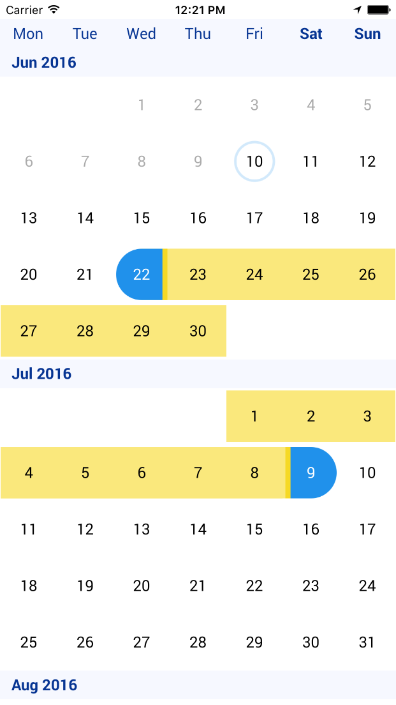
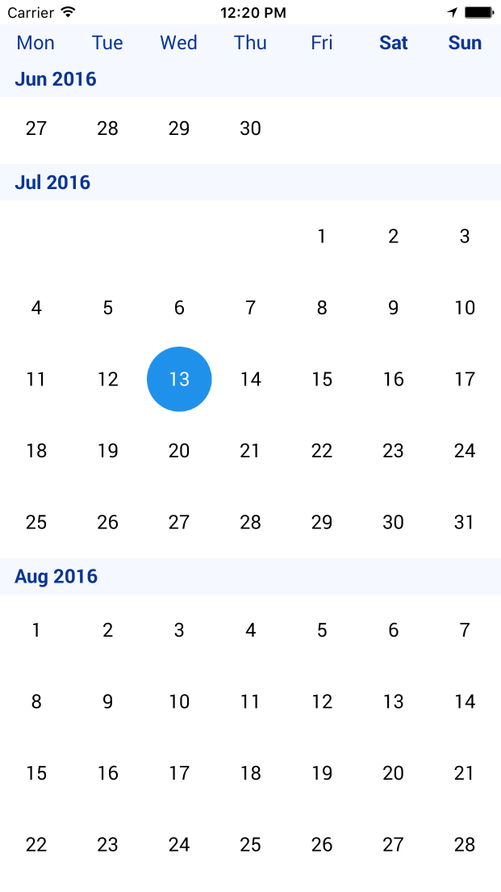

# RYRCalendar

RYRCalendar tries to bring a simple approach to implement a calendar in any iOS app using Swift 2.2




## Instalation
Will support Cocoapods and Carthage - WIP

## Requirements
Supports iOS 7 and up, written in Swift.

## Implementation

### Using Storyboard:

Create a new view, set the class to `RYRCalendar` and make an `IBOutlet` to it. 

```
@IBOutlet weak var calendar: RYRCalendar!
```

### Using code:
```
let calendar = RYRCalendar(frame: CGRectMake(0, 0, 100, 100))
```

```
calendar.delegate = self
calendar.selectionType = .Multiple
calendar.totalMonthsFromNow = 6
calendar.update()
```

- `selectionType`: Will determine the behaviour of the calendar on selection.
	
	```
	enum RYRCalendarSelectionType: Int {
   		case None, Single, Multiple
	}
	```
- `totalMonthsFromNow`: In other words, how many months will the calendar show. If you update it, call `calendar.update()`.
- `baseDate`: It is defaulted to `NSDate()`. Modify it if you want the calendar start in a different date than this.
- `style`: Defaulted to 'Ryanair app' style, it can be modified. Check Customization below for more info. 

### Delegate
You will need to implement `RYRCalendarDelegate` protocol to be able to get info from it:

```
protocol RYRCalendarDelegate: class {
   func calendarDidSelectDate(calendar: RYRCalendar, selectedDate: NSDate)
   func calendarDidSelectMultipleDate(calendar: RYRCalendar, selectedStartDate startDate: NSDate, endDate: NSDate)
   func isDateAvailableToSelect(date: NSDate) -> Bool
   func calendarDidScrollToMonth(calendar: RYRCalendar, monthDate: NSDate)
}
```

- `calendarDidSelectDate(calendar: RYRCalendar, selectedDate: NSDate)`:
It will be called every time the user selects a date. If the `.selectionType` property is set to `.Multiple`, this method will not be called when multiple dates are selected (only for the first one).

- `calendarDidSelectMultipleDate(calendar: RYRCalendar, startDate: NSDate, endDate: NSDate)`:
It will be called when both dates are selected, so you don't have to handle the logic of checking if both dates are selected. 
- `isDateAvailableToSelect(date: NSDate) -> Bool`: If you don't implement it, it will return true by default. Override it if there are any dates you don't want them to be selectable (and apply the disabled style).
- `calendarDidScrollToMonth(calendar: RYRCalendar, monthDate: NSDate)`: It is called when some new section is displayed. You can use it when you need to refresh or get more data for further months. 


##Customization
Every view inside the calendar supports customized UI elements (fonts, colors, sizes, images...). 
You can override the default style by setting a new style in the `calendar.style` property:

```
calendar.style.calendarHeaderStyle = RYRCalendarHeaderStyle(workDayFont:
	UIFont(name: "Arial", size: 15)!, 
	workDayTextColor: UIColor.yellowColor(), 
	weekendDayFont: UIFont(name: "Arial", size: 18)!, 
	weekendDayTextColor: UIColor.orangeColor(), 
	backgroundColor: UIColor.whiteColor()
)
```
Here is the main style enum from the calendar, and explanation for each property:

```
struct RYRCalendarStyle {
   // CollectionView properties
   var monthHeaderHeight: Double
   var monthHeaderStyle: RYRMonthHeaderStyle
   var calendarHeaderStyle: RYRCalendarHeaderStyle
   
   // Cell styles
   var cellStyleEnabled: RYRDayCellStyle
   var cellStyleDisabled: RYRDayCellStyle
   var cellStyleToday: RYRDayCellStyle
   var cellStyleEmpty: RYREmptyCellStyle
   
   // Single selection cell style
   var cellStyleSelected: RYRDayCellStyle
   var cellStyleSelectedMultiple: RYRDayCellStyle
   
   // Multiple selection cell styles
   var cellStyleFirstSelected: RYRDayCellStyle
   var cellStyleLastSelected: RYRDayCellStyle
   var cellStyleMiddleSelected: RYRDayCellStyle
}
```
- `monthHeaderHeight`: Height of the header for each month (section) of the calendar
- `monthHeaderStyle`: Style for the header for each month (section) of the calendar
- `calendarHeaderStyle`: Style for the header of the calendar (the view in the top with week days)
- `cellStyleEnabled`: Style for the normal state of a cell
- `cellStyleDisabled`: Style for the disabled cell (when delegate returns false for `isDateAvailableToSelect`)
- `cellStyleToday`: Style for the cell that has the same date as today
- `cellStyleEmpty`: Style for the empty spaces before the month start (just set it's background colour to the view background colour)
- `cellStyleSelected`: If the selection is `.Single`, this will be the style for the selected cell
- `cellStyleSelectedMultiple`: If the selection is `.Multiple` and user has selected two times the same date, this will be it's style. 
- `cellStyleFirstSelected`: Style for the first selection with `.Multiple` selection enabled.
- `cellStyleLastSelected`: Style for the last selection with `.Multiple` selection enabled. 
- `cellStyleMiddleSelected`: Style for the middle cells between the first date selected and the second date selected (if any). 

Check `RYRCalendarStyle` and it's properties for more information.